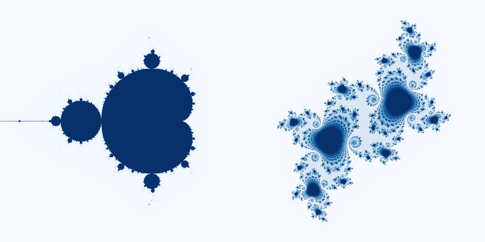

# `HorizontalPodAutoscaler`

In this example, a service (coined `trainingk8s-load`) running CPU-heavy computations (square roots or fractal calculations) is provided to experiment with `Kubernetes` autoscaling. Below the step-by-step.

Package the code in its own `Docker` image, and import it within the `Kubernetes` registry if necessary (below the `microk8s` case; reminder, this is _not_ necessary for `Docker Desktop`):

```bash
$ docker build --tag trainingk8s-load .
$ docker save trainingk8s-load > trainink8s-load.tar
$ microk8s.ctr image import trainink8s-load.tar
$ rm trainink8s-load.tar
```

The service needs three objects to be reachable from our command line: `Deployment`, `Service` and `Ingress`. The latter is not mandatory, as a separate service can be started _within_ the cluster to query the `Service`.

```bash
$ kubectl apply -f <...>.yaml
```

To define the autoscaling, use the following command line (which by now should be self-explanatory):

```bash
$ kubectl autoscale deployment trainingk8s-load --cpu-percent=75 --min=1 --max=5
```

(Remember you can extract the `YAML` declaration of any object using the `kubectl get <...> -o yaml` syntax.) Follows, the proper querying (the first line is not necessary in case you decided to implement an `Ingress` and the service is accessible from outside the cluster; the second to fourth command, inside or outside the extra `trainingk8s-load-generator` service, are either-or):

```bash
$ kubectl run -it --rm trainingk8s-load-generator --image=busybox /bin/sh
> $ while true; do wget -qO /dev/null http://trainingk8s-load/julia; done
> $ while true; do wget -qO /dev/null http://trainingk8s-load/mandelbrot; done
> $ while true; do wget -qO /dev/null http://trainingk8s-load/sqrt; done
```

The status of the `HorizontalPodAutoscaler` can of course be followed (notice the shortcut):

```bash
$ kubectl get horizontalpodautoscaler
$ kubectl get hpa
```

Note one can aggregate the logs of multiple `Pods` based on their **labels**. The selection will not be dynamically updated, and the command needs to be `Ctrl`+`C`-ed before restarted:

```bash
$ kubectl logs -l app=trainingk8s-load -f
```

The name of the various hosts should appear... Once the querying is stopped, the cooldown and **scale down will take a few minutes** for the cluster to convince itself that the load is _really_ down (default is set to 5 minutes).

As you already guessed, other metrics than CPU utilisation can be used to autoscale; but that is an experiment for another time. For more details, read the [docs](https://kubernetes.io/docs/tasks/run-application/horizontal-pod-autoscale/) or follow the [walkthrough](https://kubernetes.io/docs/tasks/run-application/horizontal-pod-autoscale-walkthrough/).



If you want to plot detailed fractals, the `niter` and `scale` arguments need to be increased: both default to 100 (see root `/` endpoint), but another order of magnitude for each should make it better. **Beware** however, the calculations will then take a lot of time! In the case of the _Julia_ set, the initial real and imaginary values can be user-defined using the `zreal` and `zimag` respectively.
